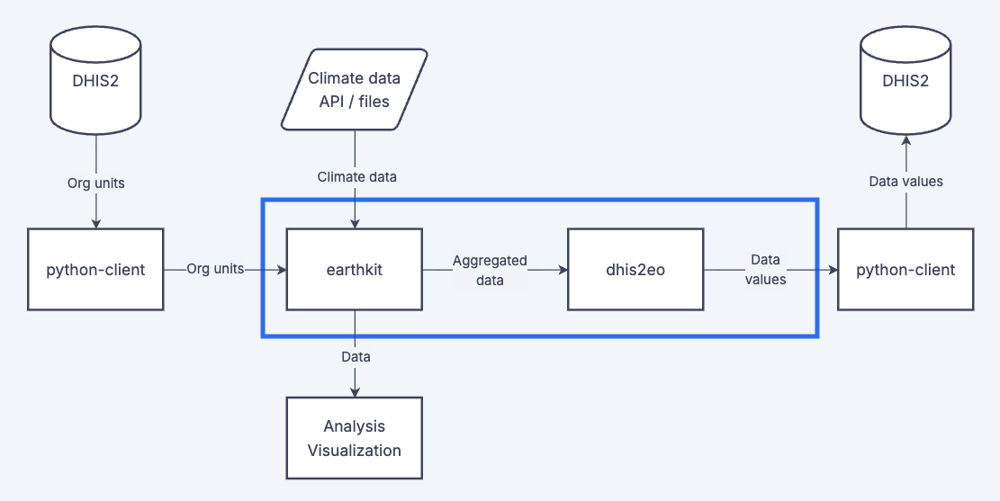

Climate data typically comes in the format of highly detailed gridded raster data, showing how climatic conditions like temperature or precipitation varies across space. In order to work with these data in DHIS2, we need to harmonize and aggregate these climatic conditions with the primary analytical unit used in DHIS2 - the [organisation unit](../glossary.md#). On these pages we provide some practical guides and tutorials for common aggregation workflows. 

