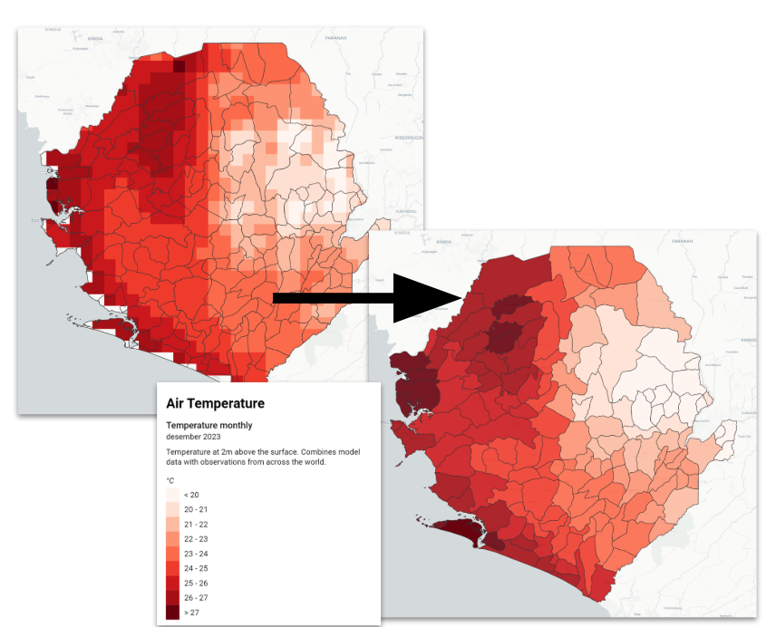

Climate data typically comes in the format of highly detailed gridded raster data, showing how climatic conditions like temperature or precipitation varies across space. In order to work with these data in DHIS2, we need to harmonize these climatic conditions with the primary analytical unit used in DHIS2 - the [organisation unit](../glossary.md#). 

This requires a process of *aggregating* the climatic data to the organisation units used by DHIS2. On these pages we demonstrate recommended practices for getting climatic data aggregated to DHIS2 organisation units. 

