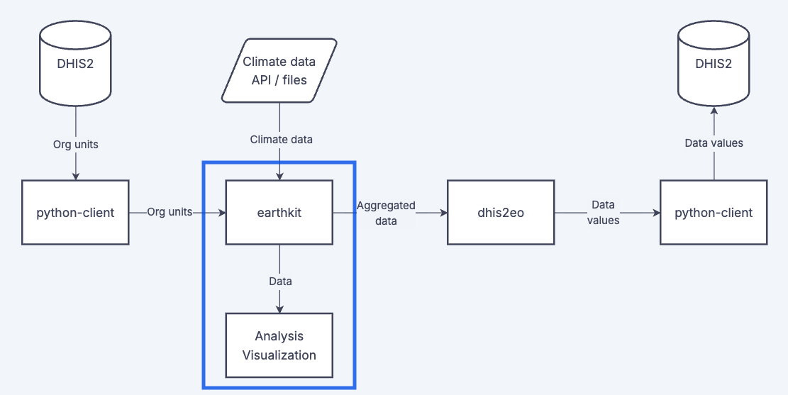

Python and Jupyter Notebook is a widely used for data analysis due to its versatility, extensive libraries, and large community support. It enables you to perform various tasks, from data cleaning and manipulation to statistical analysis.

These pages provide examples of how to perform common data analysis related to climate and environmental data.

