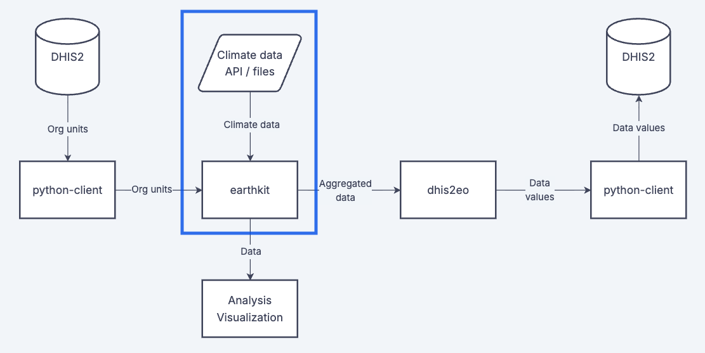

An important challenge when working with climate data is actually obtaining the data. Climate data is hosted across various sources and hosts, and can be difficult and time-consuming to access. 

On these pages we provide various guides and notebooks demonstrating recommended tools and practices to help you access useful climate datasets from reliable sources. 

