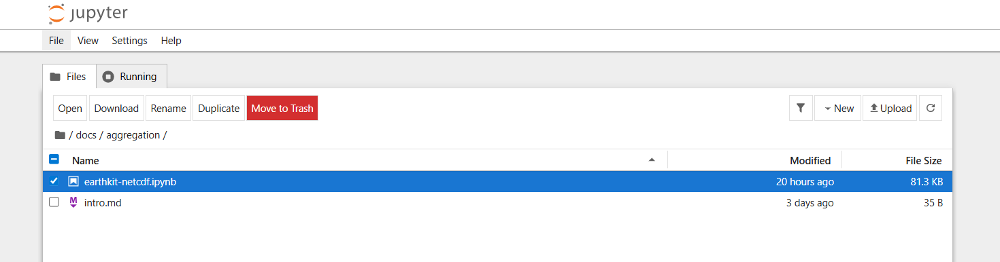
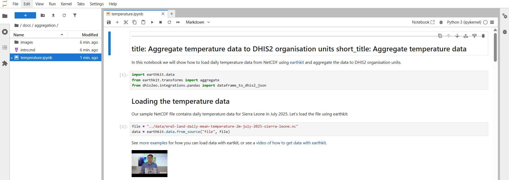

This page shows how to get started with DHIS2 Climate Tools by running its interactive Jupyter notebook tutorials and end-to-end workflows.

Specifically we describe how to run the notebooks using the classical Jupyter interface, but it's also possible to use any preferred tool such as the [VSCode Jupyter notebook extension](https://marketplace.visualstudio.com/items?itemName=ms-toolsai.jupyter). 

If you have not already downloaded the DHIS2 Climate Tools toolkit or setup the provided Python environment, first follow our [installation guide](installation.md). 

## Installing Jupyter

Jupyter can be installed with:

    pip install jupyter

## Start the Jupyter Server

Start the Jupyter server at the root of the downloaded repository folder, which will give you an overview of the folder contents:

    cd path/to/local/repo
    jupyter lab

**Note**: It's important that `jupyter` and the required dependencies are installed to the same virtual environment (e.g. in `venv` or `conda`), and that you activate this environment before you run `jupyter notebook`. This will ensure that Jupyter uses the correct Python version with all the necessary dependencies installed. 

## Browse the Notebooks

Visit http://localhost:8888, which will give you an overview of the folder contents. 

In the left-hand menu, browse the `docs` folder and look for files with `.ipynb` extensions: 

----------------------------------

## Open and run a notebook

For instance, if you navigate to the `docs/aggregation` folder you'll find the `temperature.ipynb` file: 

We recommend running the notebook step by step, which you can do by clicking each individual code cell and pressing control-enter to run it. Then you'll see the results of each code cell as you go through the document. 

## Next steps

In this tutorial we have shown how to get started with the notebooks already provided in the Climate Tools repository. 

You can also create your own notebooks for exploring data or executing common workflows. We aim to gather a collection of user-contributed notebooks for useful climate and health workflows:

- Visit the [How to Contribute page](../contribute.md) for help on how to contribute your notebooks.

For more information on how to use Jupyter Notebooks you can check out this tutorial: 

- https://www.dataquest.io/blog/jupyter-notebook-tutorial/. 
