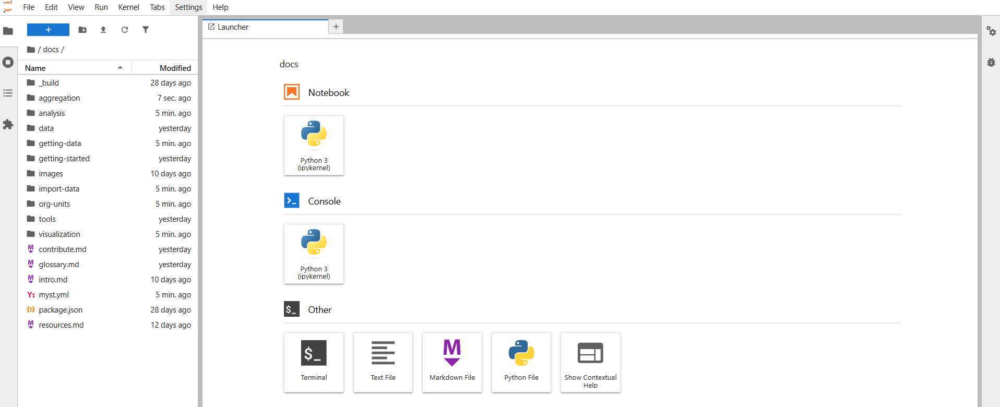

In addition to using the Python package in your scripts and favorite IDE, you also have the option to use Jupyter Notebooks to run your code more interactively. 

This repository includes some notebooks that can be used as example workflows or templates inside the `docs` folder. But it's up to you to create your own Notebooks for your own use-case. 

## Installing Jupyter

Jupyter can be installed with:

        $ pip install jupyter

## Running the server

After installation, you can navigate to the folder where you want to store your Notebooks, and start a Jupyter Notebook server:

        $ cd path/to/workspace/folder
        $ jupyter notebook

You can then visit http://localhost:8888 to view, create, and run Jupyter notebooks in the selected workspace. 

**Note**: It's important that `jupyter` and `dhis2eo` are installed to the same virtual environment (e.g. in `venv` or `conda`), and that you activate this environment before you run `jupyter notebook`. This will ensure that Jupyter uses the correct Python version with all the necessary dependencies installed. 

## Exploring the the Climate Tools Notebooks

Some of the documentation on the Climate Tools website also functions as interactive Jupyter Notebooks that can be used as learning material. To get a hold of and explore these notebooks, you have two options:

1. Manually go to https://github.com/dhis2/climate-tools and download the code repository as a zip file:

2. Programmatically download the repository using `git`:

        git clone https://github.com/dhis2/climate-tools

### Example usage

To explore the available Jupyter Notebooks included with climate tools, you can browse the `docs` folder and look for files with `.ipynb` extensions. 

- Start the Jupyter server at the root of this repository folder, which will give you an overview of the folder contents.

        $ cd path/to/github/repo
        $ jupyter notebook

- For instance, if you navigate to the `docs/aggregation` folder you'll find the `earthkit-netcdf.ipynb` file: 

- Click it to open the notebook: 

We recommend running the notebook step by step, which you can do by clicking each individual code cell and pressing control-enter to run it. Then you'll see the results of each code cell as you go through the document. 

## Next steps

For more information on how to use Jupyter Notebooks you can check out this tutorial: 

- https://www.dataquest.io/blog/jupyter-notebook-tutorial/. 
