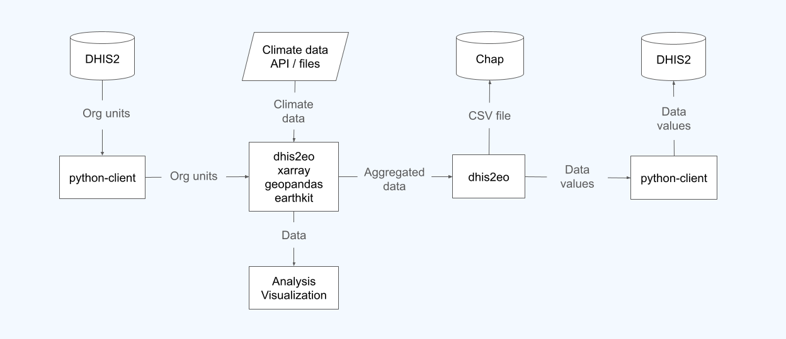

DHIS2 Climate Tools features a collection of practical how-to guides for common tasks when working with climate and environmental data in DHIS2. Each guide focuses on single, isolated steps in a larger workflow, such as accessing data, working with geographic boundaries, aggregating gridded datasets, or uploading results to DHIS2. You can follow these steps in any order and combine them as building blocks depending on [your role and what you want to accomplish](users/intro.md). 

---

Topics covered include:

- [Getting DHIS2 organisation units](org-units/intro.md)
- [Downloading climate data](getting-data/intro.md)
- [Analyzing data](analysis/intro.md)
- [Visualizing data](visualization/intro.md)
- [Aggregating data](aggregation/intro.md)
- [Importing data to DHIS2](import-data/intro.md)
- [Importing data to Chap](import-chap/intro.md)
