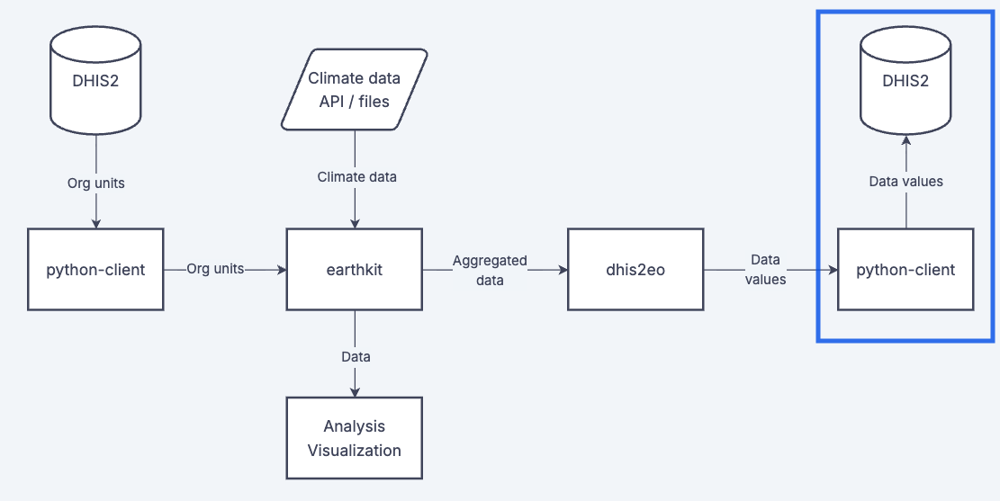

# Import data to DHIS2

DHIS2 serves as a hub for integrating routine data with climate indicators. Using the **`dhis2-python-client`** library, data imports are handled through simple helper methods that wrap the underlying **`/api/dataValueSets`** endpoint.

To import data, we first need to prepare a valid payload with `dataElement`, `period`, `orgUnit`, and `value` (plus optional disaggregation option combos) and then call the client to submit it.

