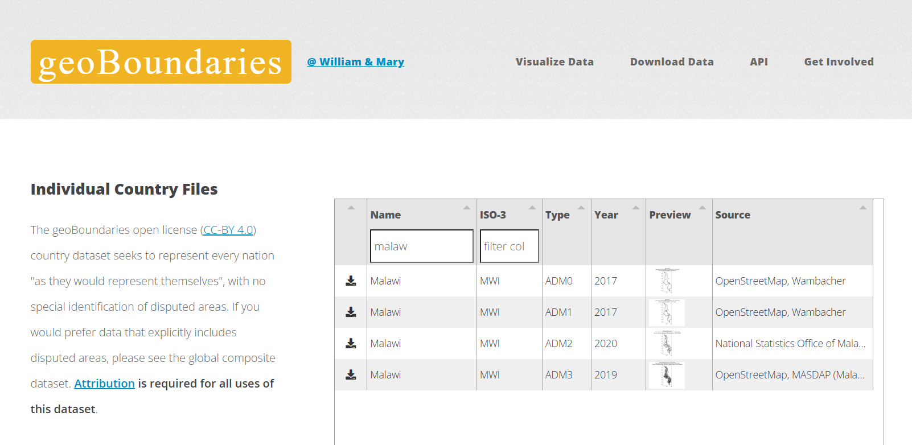
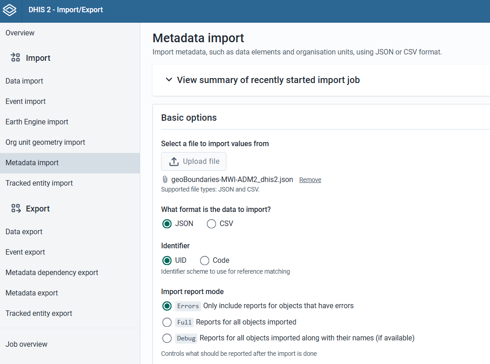
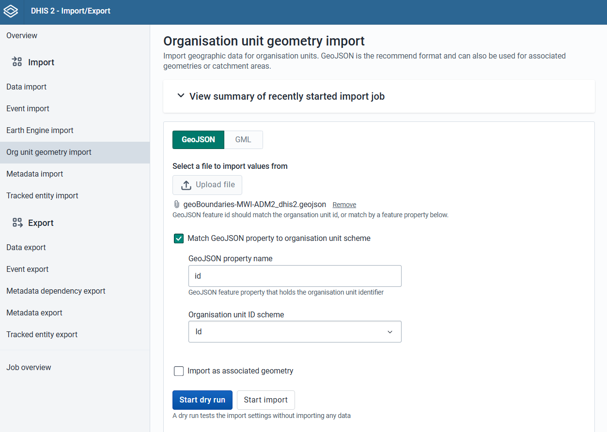
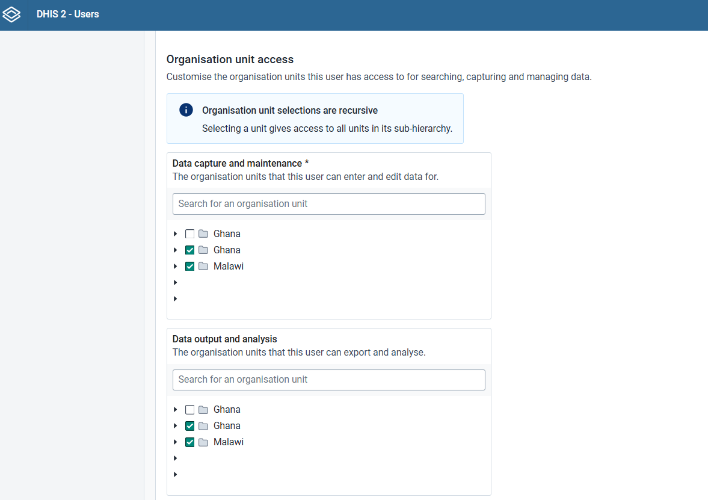

Sometimes you don't have access to a desired DHIS2 instance or need to explore different definitions of org unit boundaries in DHIS2, e.g. for testing or debugging purposes. This tutorial shows you how to create a new organization unit tree in DHIS2 (possibly for multiple countries) by using some of the provided commandline utilities. 

## Getting your boundary data

First you need a GeoJSON file containing the administrative boundaries for some country. If you don't already have this,
you can easily fetch some from https://www.geoboundaries.org/countryDownloads.html and unzip its contents. The GeoJSON must be for a single adminstrative level, and will all be linked to a single parent country. 

## Converting your boundary data to DHIS2 format

Inspect the contents of your GeoJSON file, which should print some useful info about the GeoJSON contents:

        >>> dhis2eo geojson-inspect "path/to/file.geojson"

Now that you know the structure and fields of your GeoJSON, you can convert the GeoJSON to the files needed
to upload to DHIS2. The parent country name and code are manually provided as part of the command. The org unit codes should be a field containing ideally something like an ISO code, but can also be any uniquely identifying ID. 

        >>> dhis2eo geojson-to-dhis2 "path/to/file.geojson" "<country_name>" "<name_field>"

The output files will be saved to your current working directory as:

- `path/to/file_dhis2.json` # The JSON metadata file to import the org unit structure
- `path/to/file_dhis2.geojson` # The GeoJSON file to import the geometries

## Importing into DHIS2

Importing this into DHIS2 requires two manual steps. 

### 1) Importing the org unit hierarchy

First, we have to setup the org unit hierarchy: 

1. Go to Import/Export app in DHIS2
2. On the "Metadata import" page, upload the generated file named "<your_file_name>_dhis2.json"
3. Click the Start dry run or import buttons

### 2) Importing boundary geometries

Second, we have to import the boundary geometries (these will be matched to the previously uploaded org units):

1. Go to Import/Export app in DHIS2
2. On the "Org unit geometry import" page, upload the generated file named "<your_file_name>_dhis2.geojson"
3. Check the option to "Match GeoJSON property to organisation unit scheme", and input "id" as the property name and select "Id" for ID scheme. [TODO: Check, this may or may not be necessary]
4. Click the Start dry run or import buttons

## Final steps

Finally, before you can do anything with the newly created org units, you need to:

1. Update analytics tables from the Data Administration app
2. Make sure to go to the Users app and enable so that your user can view the newly imported org unit hierarchy tree

