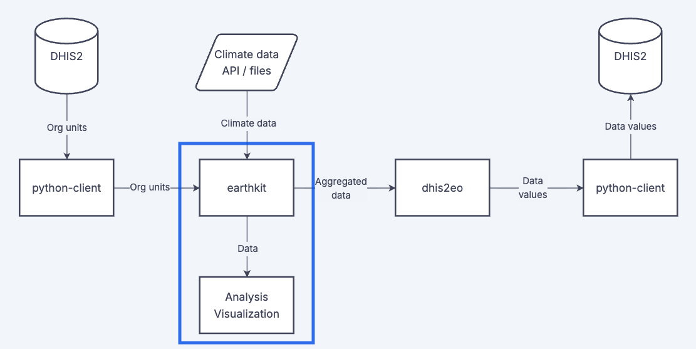

Visualizing data on geographic maps is essential when working with climate data. Mapping climate data helps to: 1) Check and verify the validity and quality of input data, 2) Review the results of data processing, and 3) Share findings with stakeholders.

These pages provide good practices for visualizing and mapping common climate data sources.

